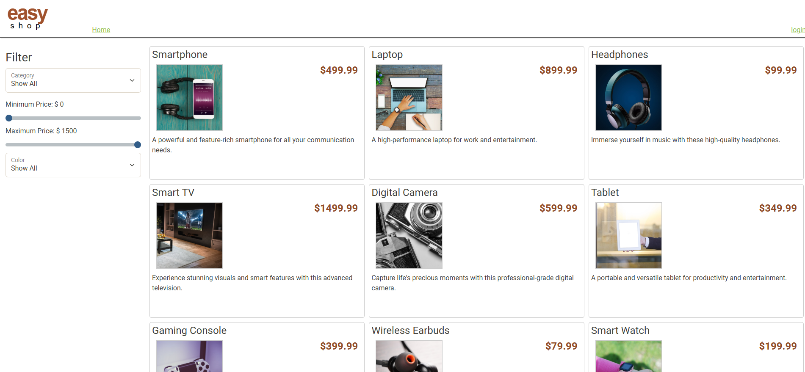
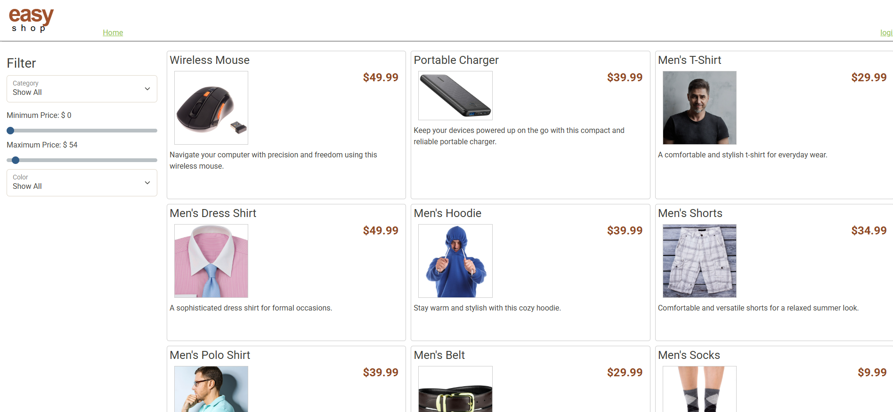
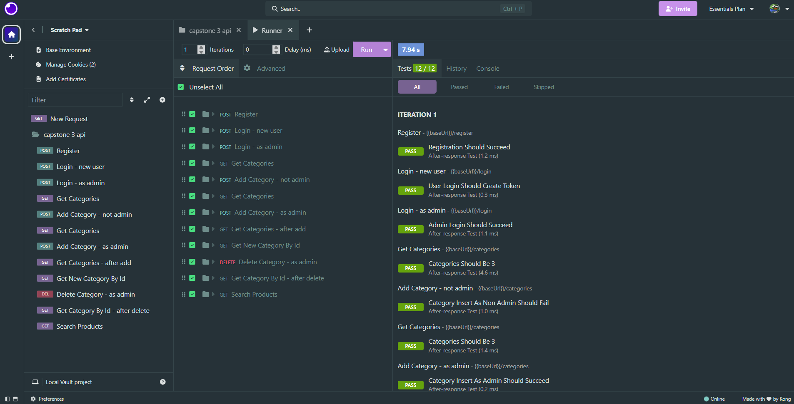

# 🛒 EasyShop – E-Commerce API


EasyShop is a full-stack e-commerce application built with **Java Spring Boot**, **MySQL**, and a lightweight **HTML/CSS/JavaScript frontend**.  
This project was completed as **Capstone 3** for the Year Up United Java Focus Academy.

The application supports secure authentication, product searching with filters, category management, and role-based access control using JWTs.

---

## 🚀 Features

### 🔐 Authentication & Authorization
- User registration and login
- Role-based authorization (USER vs ADMIN)
- Protected endpoints using Spring Security

### 📦 Products
- Search products with filters:
   - Category
   - Minimum price
   - Maximum price
   - Subcategory (color)
- View product details
- Admin-only product creation, updates, and deletion

### 📁 Categories
- Retrieve all categories
- Retrieve category by ID
- Admin-only category creation and deletion

### 💻 Frontend
- Dynamic product listing
- Category and price filter

---
## 👨🏻‍💻 Interesting Piece of Code

My last Insomnia test was failing because my controller was expecting a parameter called categoryId, but the test was sending cat. Since Spring matches query parameters by name, the value was coming in as null. That caused my default logic to ignore the category filter and return all products. Once I explicitly mapped cat to categoryId using @RequestParam(name="cat"), the filtering worked and the test passed.

```java     
@GetMapping
@PreAuthorize("permitAll()")
public List<Product> search(
@RequestParam(name="cat", required = false) Integer categoryId,
@RequestParam(name="minPrice", required = false) BigDecimal minPrice,
@RequestParam(name="maxPrice", required = false) BigDecimal maxPrice,
@RequestParam(name="subCategory", required = false) String subCategory
```
---
## 🖼️ Screenshots

### Home Page & Product Listings

### Filtered Product Search

### Admin Category Management

---

## 🧰 Tech Stack

| Layer        | Technology |
|-------------|------------|
| Backend     | Java, Spring Boot |
| Security    | Spring Security, JWT |
| Database    | MySQL |
| Frontend    | HTML, CSS, JavaScript |
| API Testing | Insomnia |
| Build Tool  | Maven |

---
